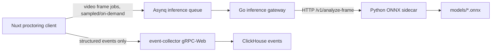

# Argus AI Architecture

This document describes Step 2 of the Argus proctoring AI pipeline: browser-local MediaPipe/audio signals plus backend ONNX inference through an isolated Python sidecar.

## Runtime Topology



The exam session path does not wait on ONNX inference. MediaPipe and audio VAD run in the browser at low frequency and send only structured events. Backend deep inference runs behind queue/concurrency limits; overloaded frames are dropped instead of blocking the student.

## Regression Guardrails

- **Thread isolation:** model work is outside the main event ingestion flow. The Go inference gateway talks to the sidecar; workers enqueue/consume inference tasks separately.
- **Circuit breaker:** `cmd/inference` applies `inference.concurrency` as a bounded worker pool. If the pool is full, the frame is rejected with `ResourceExhausted` and can be dropped or retried by background workers.
- **Fail-fast:** production cannot silently fall back to synthetic inference. `engine_type=stub` requires `allow_stub=true`; `python_bridge` checks `/healthz` and refuses startup unless YOLO and ArcFace are loaded.
- **Frame economy:** video segments must be sampled by interval or explicit event trigger. `FRAME_EXTRACTION_INTERVAL_SEC`/`inference.frame_sample_interval_sec` are the control knobs.
- **No raw-video pseudo frames:** the Go `AnalyzeVideo` RPC currently accepts only pre-extracted `image/jpeg`, `image/png`, or `image/webp` frames. Raw `video/*` blobs return `Unimplemented` instead of pretending arbitrary bytes are JPEG frames.
- **Backward compatibility:** existing event contracts are not changed. Audio anomalies reuse the existing `AudioAnalysisPayload` fields and ClickHouse columns.

## Model Inventory

| Model | File | Source | Purpose | Input | Output |
| --- | --- | --- | --- | --- | --- |
| YOLOv8n ONNX | `models/yolov8n.onnx` | Ultralytics YOLOv8 export | Object detection for `person`, `cell phone`, `book`; custom future exports can add earbuds/headphones | usually `[1,3,640,640]` FP32 RGB | YOLO detections, commonly `[1,84,8400]` |
| ArcFace/InsightFace ONNX | `models/arcface.onnx` | InsightFace model zoo | Face embedding and identity verification against enrolled reference embedding | commonly `[1,3,112,112]` FP32 RGB | embedding vector, commonly 512 floats |

Source references:
- Ultralytics YOLOv8: https://docs.ultralytics.com/models/yolov8/
- InsightFace: https://github.com/deepinsight/insightface
- ONNX Runtime: https://onnxruntime.ai/

`ai-sidecar/model_manifest.json` is the source of truth for local model filenames and private artifact configuration. Large model binaries are excluded by `.gitignore`; store them in `models/` locally, mount them at `/models` in Docker, or download them from an internal artifact store before starting the sidecar.

The downloader validates minimum file size for every model and SHA256 when a checksum is supplied:

```bash
python ai-sidecar/scripts/download_models.py --models-path models --check-only --require-sha256
```

Use `ARGUS_YOLO_ONNX_URL` and `ARGUS_ARCFACE_ONNX_URL` for private model URLs, with matching `ARGUS_YOLO_ONNX_SHA256` and `ARGUS_ARCFACE_ONNX_SHA256` values in production. The ArcFace URL may point to a zip archive; set `ARGUS_ARCFACE_ARCHIVE_MEMBER` when the archive contains multiple ONNX files.

## Environment And Config Mapping

Backend Go config:

| YAML | Environment | Default | Description |
| --- | --- | --- | --- |
| `inference.engine_type` | `EVENT_COLLECTOR_INFERENCE_ENGINE_TYPE` | `python_bridge` | Selects `stub` or `python_bridge`; `stub` is accepted only when `allow_stub=true`. |
| `inference.allow_stub` | `EVENT_COLLECTOR_INFERENCE_ALLOW_STUB` | `false` | Enables stub only for local development. |
| `inference.python_bridge_url` | `EVENT_COLLECTOR_INFERENCE_PYTHON_BRIDGE_URL` | `http://localhost:8091` | Python sidecar base URL. |
| `inference.bridge_timeout_sec` | `EVENT_COLLECTOR_INFERENCE_BRIDGE_TIMEOUT_SEC` | `5` | Health check and inference HTTP timeout. |
| `inference.concurrency` | `EVENT_COLLECTOR_INFERENCE_CONCURRENCY` | `4` | Max simultaneous frame analyses in the Go gateway. |
| `inference.frame_sample_interval_sec` | `EVENT_COLLECTOR_INFERENCE_FRAME_SAMPLE_INTERVAL_SEC` | `5` | Minimum interval for heavy video frame extraction. |
| `inference.face_mismatch_threshold` | `EVENT_COLLECTOR_INFERENCE_FACE_MISMATCH_THRESHOLD` | `0.62` | Identity mismatch cutoff. |
| `inference.object_confidence_threshold` | `EVENT_COLLECTOR_INFERENCE_OBJECT_CONFIDENCE_THRESHOLD` | `0.35` | YOLO object confidence cutoff. |

Python sidecar config:

| Environment | Default | Description |
| --- | --- | --- |
| `ONNX_MODELS_PATH` | `models` locally, `/models` in Docker | Directory containing model files. |
| `YOLO_MODEL_FILE` | `yolov8n.onnx` | YOLO ONNX filename. |
| `ARCFACE_MODEL_FILE` | `arcface.onnx` | ArcFace ONNX filename. |
| `MODEL_FAIL_FAST` | `true` | If true, missing/corrupt models abort startup. |
| `YOLO_CONFIDENCE_THRESHOLD` | `0.35` | Sidecar object detection threshold. |
| `FACE_MISMATCH_THRESHOLD` | `0.62` | Sidecar identity threshold for future local classification. |
| `AUDIO_VAD_THRESHOLD` | `0.65` | Browser/sidecar-compatible VAD threshold. |
| `FRAME_EXTRACTION_INTERVAL_SEC` | `4.0` | Safe default: at most one deep frame every 4 seconds unless event-triggered. |

Frontend audio config:

| Setting | Default | Description |
| --- | --- | --- |
| `realtimeAudio.enabled` | `true` | Turns browser-local audio analytics on/off. |
| `realtimeAudio.analysisHz` | `4` | Low-cost audio feature extraction frequency. |
| `realtimeAudio.thresholds.noiseRmsDbThreshold` | `-25` | Noise anomaly threshold. |
| `realtimeAudio.thresholds.vadConfidenceThreshold` | `0.65` | Voice activity threshold. |

## ClickHouse Event Mapping

Audio and AI events continue to flow through the existing `events` schema. The relevant fields are:

| Column / Field | Source |
| --- | --- |
| `event_type` | `VOICE_ACTIVITY`, `AUDIO_ANOMALY`, `WHISPER_DETECTED`, `SECOND_SPEAKER_DETECTED`, `AUDIO_LEVEL_TELEMETRY`, backend AI event types |
| `severity` | Client or worker decision |
| `audio_rms_db` | Browser `useAudioEngine` RMS feature |
| `audio_vad_active` | Browser VAD flag |
| `audio_classification` | `speech`, `whisper`, `music`, `keyboard`, `ambient`, `silence` |
| `confidence` | Rule confidence or model confidence |
| `source` | Browser, webcam, backend AI |

The AI layer does not write to PostgreSQL transactions in the student session path. ClickHouse writes remain asynchronous.

## Operational Notes

Place model weights under `argus-backend/models/` for local testing or mount them at `/models` in the sidecar container. Do not commit large `.onnx` binaries unless Git LFS is explicitly configured.

The backend does not continuously decode WebM/MP4 evidence fragments. Background workers should send already sampled image frames to the inference gateway, or skip the fragment until the safe extractor worker is available. This keeps the exam session path independent from FFmpeg load and prevents ONNX from receiving invalid raw video bytes.

`AIAnalysisHandler` enforces this at the worker boundary: `image/jpeg`, `image/png`, and `image/webp` evidence fragments may be sent directly to inference, while `video/mp4` and `video/webm` fragments are sampled through the bounded FFmpeg extractor first. Unsupported content types are skipped before storage download.

The extractor uses the configured `inference.frame_sample_interval_sec` and `inference.max_video_dur_sec` values to build a bounded FFmpeg command with `-nostdin`, `fps=1/N`, and `-frames:v max`. The worker then sends each extracted JPEG through `AnalyzeFrame`, preserving the sampled timestamp in `video_timestamp_sec`.

Docker runtime is split by responsibility: `Dockerfile.worker` runs the Asynq worker with `ffmpeg`, `Dockerfile.inference` runs the Go gRPC gateway, and `ai-sidecar/Dockerfile` runs ONNX Runtime. `docker-compose.yml` wires worker → inference → ai-sidecar. The root `.dockerignore` keeps Go image contexts small by excluding model weights, sidecar sources, VCS metadata, build caches, and large evidence media.

Run locally:

```bash
cd ai-sidecar
python -m venv .venv
source .venv/bin/activate
pip install -r requirements.txt
ONNX_MODELS_PATH=../models uvicorn app.main:app --host 0.0.0.0 --port 8091
```

Docker:

```bash
docker build -t argus/ai-sidecar:local ai-sidecar
docker run --rm -p 8091:8091 -v "$PWD/models:/models:ro" argus/ai-sidecar:local
```

Future GPU deployment can switch the sidecar image to a CUDA runtime and use ONNX Runtime GPU providers without changing the Go event ingestion contract.

## Remaining Work

- Persist extracted frame metadata so retries do not decode the same evidence fragment repeatedly.
- Add event-triggered extraction windows around critical frontend MediaPipe/audio anomalies.
- Extend ClickHouse analytics columns only after the existing event payload contract has stayed backward-compatible in staging.
