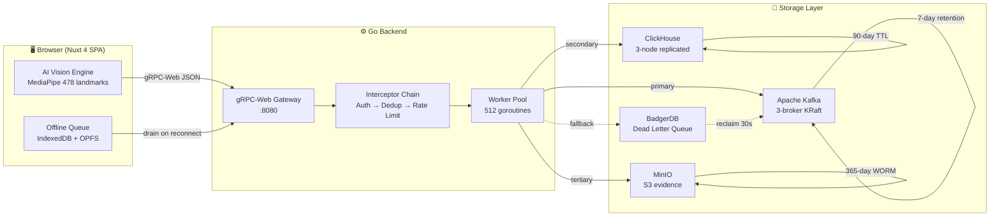
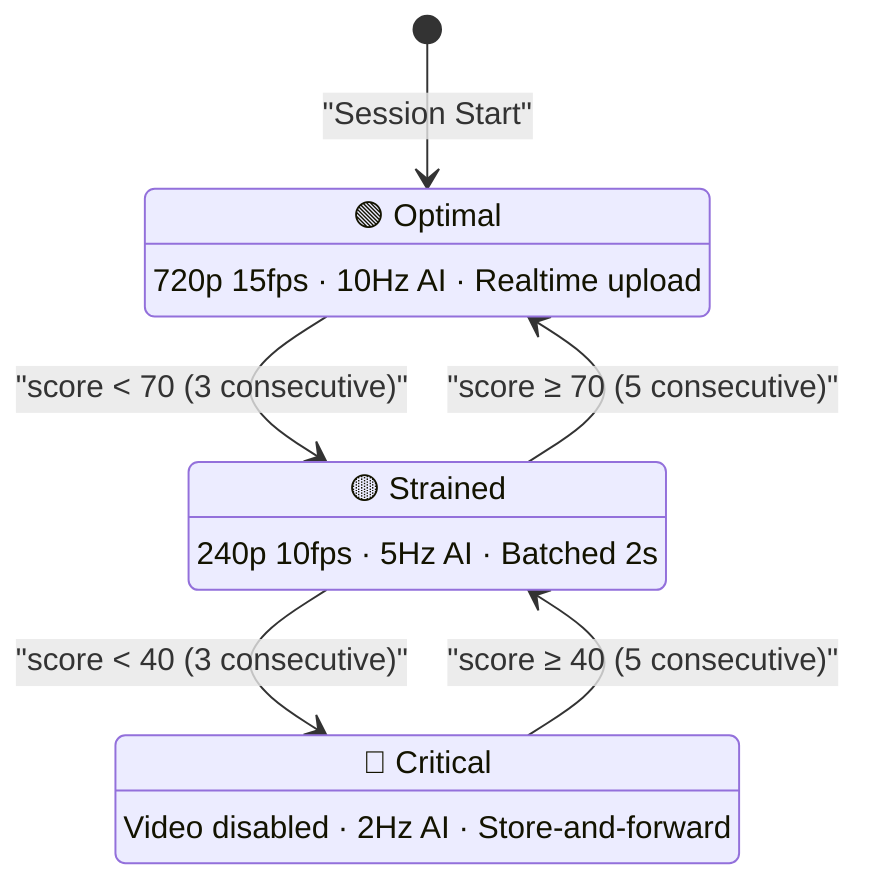
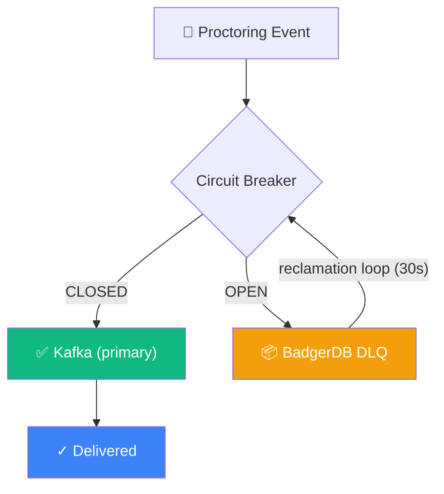

<p align="center">
  
</p>

<h1 align="center">Argus AI</h1>

<p align="center">
  <strong>Sovereign AI-Powered Exam Proctoring Platform</strong><br/>
  Real-time fraud detection &bull; Forensic evidence chain &bull; 10,000+ concurrent sessions
</p>

<p align="center">
  
  
  
  
  
  
  
</p>

---

Argus AI is a production-grade AI proctoring system built for Kazakhstan's national examination infrastructure. The platform processes proctoring events from thousands of simultaneous browser sessions through a Go + Kafka + ClickHouse pipeline, with an offline-first Nuxt 4 frontend that adapts in real-time to device capabilities and network conditions.

**Proven at scale:** 10,000 concurrent users, 1,157,608 events ingested, P50 = 7.0ms, P95 = 17.9ms, P99 = 29.2ms — with zero data loss.

---

## Table of Contents

- [Architecture Overview](#-architecture-overview)
- [Core Systems](#-core-systems--the-indestructible-layer)
- [Stress Testing & Chaos Engineering](#-stress-testing--chaos-engineering)
- [Developer Experience](#-developer-experience)
- [Technical Stack](#-technical-stack)
- [Disaster Recovery](#-disaster-recovery)
- [Installation & Deployment](#-installation--deployment)

---

## 🏛 Architecture Overview

Argus AI is a polyrepo ecosystem. Three repositories, three teams, one event pipeline.

| Repository | Stack | Purpose |
|------------|-------|---------|
| `argus-backend` | Go 1.24, gRPC, Kafka, ClickHouse | Event ingestion, analytics, admin API |
| `argus-frontend` | Nuxt 4, Vue 3, TypeScript, Tailwind | SPA dashboard, proctoring UI, /docs |
| `argus-infra` | Docker Compose, Nginx, CI/CD | Orchestration, migrations, deployment |

The frontend communicates with the backend exclusively via **gRPC-Web** (JSON over HTTP) and REST endpoints under `/api/v1/`. The proto definition at `argus-backend/api/proto/v1/event_collector.proto` is the single source of truth for the wire format.

### Data Flow Pipeline



### Failure Semantics

Failure handling is **asymmetric by design**:

| Component Failure | Event Status | Rationale |
|-------------------|--------------|-----------|
| Kafka write fails | **Rejected** | Client retries or queues offline. Kafka is the append-only source of truth. |
| ClickHouse write fails | **Accepted** | ClickHouse rebuilds from Kafka. Never blocks ingestion. |
| Evidence capture fails | **Accepted** | Async pipeline. Never on the critical path. |

### gRPC Service

The `EventCollectorService` exposes 4 RPCs handling **85 event types** across **7 sources** with **11 typed payloads**:

| RPC | Transport | Purpose |
|-----|-----------|---------|
| `IngestEvent` | Unary | Single critical event (immediate delivery) |
| `IngestBatch` | Unary | Batched telemetry (tier-adaptive interval) |
| `StreamEvents` | Bidirectional stream | Continuous high-frequency ingestion |
| `Heartbeat` | Unary | Session keepalive + server directives |

---

## 🛡 Core Systems — The Indestructible Layer

Seven hardening gaps were closed to make Argus AI resilient to network failures, CPU spikes, browser crashes, and infrastructure outages — without losing a single event.

### Adaptive AI Engine

The Health Governor continuously monitors device capabilities and automatically adjusts monitoring quality through a **three-tier degradation system**.

**Health Score Formula:**

```
Score = FPS(35%) + RTT(35%) + PacketLoss(30%) - CPUPenalty(max 20)
```

- **FPS**: requestAnimationFrame loop. 30fps = 100, 15fps = 0.
- **RTT**: /healthz ping round-trip. ≤100ms = 100, ≥2000ms = 0 (logarithmic).
- **Packet Loss**: Failed gRPC request ratio. 0% = 100, ≥10% = 0.
- **CPU Penalty**: AI inference latency >50ms triggers penalty. 150ms+ = -20 (capped).



**Hysteresis** prevents tier flapping: 3 consecutive degraded samples to downgrade, 5 to upgrade. No direct A↔C jumps — always passes through B.

| Capability | Tier A (≥ 70) | Tier B (40–70) | Tier C (< 40) |
|------------|---------------|----------------|----------------|
| Video | 720p, 15 fps | 240p, 10 fps | Disabled (burst 1fps/30s) |
| AI Inference | 10 Hz, full model | 5 Hz, lite model | 2 Hz, minimal |
| Upload Strategy | Realtime (500ms) | Batched (2000ms) | Store-and-forward (5000ms) |
| Telemetry | 100ms (10 Hz) | 300ms (~3 Hz) | 1000ms (1 Hz) |
| Audio | 16 kHz | 8 kHz | 8 kHz |

**In-Browser AI Pipeline:**
- **MediaPipe Face Mesh** — 478 facial landmarks, GPU-accelerated via WebGL, <16ms per frame at 720p
- **Head Pose Estimation** — Geometric ratio approximation (yaw/pitch/roll ±90°)
- **Gaze Tracking** — Iris landmark regression with directional classification
- **Blink Detection** — Eye Aspect Ratio (EAR) algorithm, 60-second rolling window
- **Liveness Scoring** — Composite of blink rate, texture quality, and EAR stability
- **CPU Monitoring** — Rolling 5-frame inference latency. >100ms avg for 3+ frames triggers `HIGH_CPU_LOAD`

**Clock Synchronization:** NTP-style offset estimation from heartbeat round-trips. Median of 5 samples rejects RTT outliers. Prevents JWT expiration when student system clocks are skewed.

### Self-Healing Backend

Every write path is protected by circuit breakers and backed by a dead-letter queue. The system degrades gracefully — never crashes, never drops data.



**Dead Letter Queue (DLQ):**
- Engine: BadgerDB v4.9.1 (pure Go, zero CGO, crash-safe)
- Ordering: FIFO via nanosecond-timestamped keys
- Capacity: 1,000,000 entries maximum
- Durability: `SyncWrites = true` — fsync on every write
- Reclamation: Background goroutine drains 100 events every 30 seconds when circuit closes
- Admin: `POST /api/v1/admin/system-reset` with `clear_dlq` action for emergency purge

**Circuit Breakers** (sony/gobreaker v1.0.0):
- Three-state model: Closed → Open → Half-Open → Closed
- ClickHouse breaker: 5 consecutive failures → Open, 30s probe timeout
- Kafka breaker: configurable threshold, Telegram alert on Open transition
- Manual reset via admin API for immediate recovery

**ClickHouse Writer:**
- Native protocol (2-3x faster than HTTP), columnar batch encoding
- Two-stage buffer swap: fills buffer A while flushing buffer B
- Overflow queue: soft limit = 50 batches (warning), hard limit = 200 (backpressure)
- Retry: exponential backoff with jitter (100ms base, 1.5x multiplier)
- Batches are **never dropped** — overflow queue absorbs all spikes

**Kafka Producer:**
- Idempotent delivery (`enable.idempotence = true`) — exactly-once semantics
- zstd compression (5–8x on JSON payloads)
- Partition key: `session_id` — guarantees per-session event ordering
- Async batching: 100ms flush interval, 100 messages, 1 MiB flush bytes

**Worker Pool:** 512 goroutines with a 16,384-depth bounded queue. Backpressure propagates to the gRPC layer when the queue fills — the client sees `RESOURCE_EXHAUSTED` and backs off.

**Rate Limiting:** 50,000 global RPS for gRPC event ingestion, 5,000 global RPS for HTTP admin API. Per-session: 100 RPS (burst 200). Per-IP (HTTP): 100 RPS (burst 200).

**Forensic Ledger:** SHA-256 hash chain per session. Each evidence fragment includes the hash of the previous fragment, creating a tamper-evident chain. A `GENESIS` entry anchors the chain at session start.

### Enterprise Multi-Tenancy

Every event carries an `org_id` field. Data isolation is enforced at every layer.

**RBAC Hierarchy:**

| Role | Scope | Capabilities |
|------|-------|-------------|
| `super_admin` | Global | Full system access, org management, infrastructure |
| `org_admin` | Organization | API keys, webhooks, IP whitelist, settings |
| `proctor` | Organization | Live monitoring, violation review, session control |
| `viewer` | Organization | Read-only dashboards, analytics, exports |

**PostgreSQL Admin Layer:** Organizations, users, API keys, webhook configurations, audit log, consent records, appeals — all scoped by `org_id`.

**Session Validation:** Eduser LMS integration with caching. Valid sessions cached for 5 minutes, invalid for 30 seconds. Cache cleanup every 60 seconds.

**Data Retention:**

| Storage Layer | Retention | Purpose |
|---------------|-----------|---------|
| Kafka | 7 days | Event replay, rebuilds |
| ClickHouse (raw) | 90 days | Real-time analytics |
| ClickHouse (hourly MVs) | 180 days | Trend analysis |
| ClickHouse (org stats) | 365 days | Annual reporting |
| MinIO (evidence) | 365 days (WORM) | Legal compliance |
| PostgreSQL | Indefinite | Admin, audit trail |

**Offline Queue:** IndexedDB primary storage with OPFS (Origin Private File System) fallback. 500 MB maximum capacity. Priority drain order: `critical > high > normal > low`. HMAC-SHA256 event signing for tamper evidence. Storage quota monitored every 30 seconds — hard-blocks the exam at 90% utilization to prevent data loss.

---

## 🔥 Stress Testing & Chaos Engineering

### Load Testing (k6)

The k6 script simulates 5,000 concurrent students sending realistic proctoring events.

```bash
# Default: 5000 VUs, localhost:8080
k6 run scripts/k6/load-test.js

# Custom: 1000 VUs, remote backend
k6 run scripts/k6/load-test.js --env VUS=1000 --env BASE_URL=http://prod:8080
```

**Scenario (ramping-vus, 10 minutes total):**

| Stage | Duration | VUs | Phase |
|-------|----------|-----|-------|
| Warm-up | 1 min | 0 → 1,000 | Establish connections |
| Ramp | 2 min | 1,000 → 5,000 | Stress ramp |
| Sustained | 5 min | 5,000 | Peak load |
| Cool-down | 2 min | 5,000 → 0 | Graceful drain |

**Student Profile Distribution:**
- **80% Honest** — occasional `GAZE_DEVIATION` (low confidence), regular heartbeats
- **15% Suspicious** — frequent `HEAD_POSE_ANOMALY`, `VOICE_ACTIVITY` (medium confidence)
- **5% Cheater** — `PHONE_DETECTED`, `MULTIPLE_PERSONS`, `FACE_MISMATCH` (high confidence)

**Thresholds (pass/fail):**

| Metric | Target |
|--------|--------|
| Batch ingest P95 | < 50ms |
| Batch ingest P99 | < 100ms |
| Heartbeat P95 | < 30ms |
| Heartbeat P99 | < 50ms |
| Error rate | < 1% |
| Batch acceptance | > 99% |
| Idempotency dedup | > 90% |

**Idempotency Validation:** 10% of batches replay a previous `batch_id`. The server must reject duplicates with `accepted_count = 0`.

### Chaos Engineering

A standalone Go binary that orchestrates infrastructure failures to validate self-healing behavior.

```bash
# Full chaos (requires Docker)
go run scripts/chaos/main.go

# API-only mode (no Docker pause/unpause)
go run scripts/chaos/main.go -skip-docker

# Custom backend
go run scripts/chaos/main.go -backend http://prod:8080
```

**6-Phase Chaos Sequence:**

| Phase | Duration | Action | Validates |
|-------|----------|--------|-----------|
| 1. Baseline | ~5s | Health snapshot | All breakers closed, DLQ = 0 |
| 2. CH Outage | 30s | `docker pause` ClickHouse ×3 | CH breaker opens, overflow grows |
| 3. CH Recovery | 45s | Unpause + reset breaker + flush | Breaker closes, overflow drains to 0 |
| 4. Kafka Outage | 30s | `docker pause` Kafka ×3 | Kafka breaker opens, DLQ catches events |
| 5. Kafka Recovery | 45s | Unpause + reset breaker | DLQ drains via reclamation loop |
| 6. Combined | 30s | Pause ALL (CH + Kafka) | Both breakers open, no goroutine leak |

Each phase polls `GET /api/v1/admin/system-health` every 2–3 seconds and asserts expected state transitions.

### Previous Benchmark (10K Users)

The native Go load generator (`cmd/loadtest/`) achieved the following under sustained 10,000-user load:

| Metric | Value |
|--------|-------|
| Concurrent users | 10,000 |
| Total events | 1,157,608 |
| Ingestion rate | 100% |
| P50 latency | 7.0 ms |
| P95 latency | 17.9 ms |
| P99 latency | 29.2 ms |

Optimizations applied during the benchmark: worker pool 256 → 512, ClickHouse batch size 1,000 → 5,000, HTTP rate limiter 1,000 → 5,000 global RPS.

---

## 🧑‍💻 Developer Experience

### Documentation Portal (`/docs`)

A Stripe-style public documentation page (English) accessible without authentication.

**8 Sections:** Getting Started, Authentication, Session Flow, Idempotency & Resilience, Webhooks, Error Handling, Widget Integration, API Reference.

**Features:**
- Scrollspy navigation with sticky sidebar
- Real-time client-side search
- Syntax-highlighted code snippets (cURL, Node.js, React)
- Interactive 4-step integration flow diagram (Auth → Session → Widget → Webhooks)
- Deep-linking via anchor IDs (`/docs#webhooks`)
- Mobile-responsive with hamburger nav

### Admin Integrations Dashboard (`/integrations`)

A self-service dashboard for university IT teams (Russian language). Requires `org_admin` or `super_admin` role.

**5 Tabs:**

| Tab | Capabilities |
|-----|-------------|
| API Keys | Create, revoke, copy keys. Environment (live/test), 8 permission scopes |
| Webhooks | Configure URLs, select events, toggle active/inactive, send test payloads |
| IP Whitelist | Add/remove IP addresses and CIDR ranges with validation |
| Swagger | Link to Swagger UI with OpenAPI spec |
| Hard Gate | PreExamCheck 4-stage flow documentation (media → face → storage → network) |

### Performance Debugger

Press **`Ctrl+Shift+D`** during any proctoring session to open a real-time diagnostic overlay.

Displays: health score, current tier, FPS, RTT, packet loss, CPU pressure, inference latency, vision engine stats (model status, face count, gaze deviations), tier transition history, connection status, queue depth, server directive, and event throughput metrics.

---

## 📦 Technical Stack

### Frontend

| Technology | Version | Role |
|------------|---------|------|
| Nuxt | 4.3.1 | Application framework (SPA mode) |
| Vue | 3.x | Reactive UI layer |
| TypeScript | 5.9.3 | Type safety |
| Tailwind CSS | 4.1.18 | Utility-first styling |
| Pinia | 2.3.0 | State management |
| chart.js | 4.5.1 | Analytics visualizations |
| LiveKit Client | 2.17.1 | WebRTC video |
| Playwright | 1.58.2 | E2E testing |

### Backend

| Technology | Version | Role |
|------------|---------|------|
| Go | 1.24.0 | Language |
| gRPC | 1.75.1 | Event ingestion protocol |
| Protobuf | 1.36.11 | Wire format (85 event types) |
| Kafka (sarama) | 1.43.3 | Event streaming (idempotent, zstd) |
| ClickHouse | 2.30.1 | Analytical storage (native protocol) |
| PostgreSQL | 16 | Transactional storage (admin, RBAC) |
| Redis | 7 | Job queue (Asynq) |
| BadgerDB | 4.9.1 | Dead letter queue (DLQ) |
| MinIO | latest | S3-compatible evidence storage |
| gobreaker | 1.0.0 | Circuit breakers |
| zap | 1.27.0 | Structured logging |
| LiveKit Server | latest | WebRTC SFU |

### AI & Detection

| Capability | Technology | Detail |
|------------|------------|--------|
| Face Mesh | MediaPipe FaceLandmarker | 478 landmarks, GPU-accelerated (WebGL) |
| Head Pose | Geometric approximation | Yaw/Pitch/Roll ±90°, 6-point model |
| Gaze Tracking | Iris landmark regression | 15° threshold, directional classification |
| Blink Detection | Eye Aspect Ratio (EAR) | 0.21 threshold, 60s rolling window |
| Liveness | Composite heuristic | Blink rate + texture + EAR stability |
| Object Detection | YOLO-based | Phone, book, earbuds, unknown objects |
| Audio Analysis | Web Audio API | VAD, speaker ID, whisper detection |

### Infrastructure

| Component | Configuration |
|-----------|--------------|
| Kafka | 3-broker KRaft, replication-factor 3, min.insync.replicas 2, 6 partitions |
| ClickHouse | 3 data nodes + 3 Keeper nodes, ReplicatedMergeTree |
| Docker Compose | 16 containers, 17 named volumes, bridge network |
| gRPC Server | 10,000 max concurrent streams, 4 MiB max message size |
| Worker Pool | 512 goroutines, 16,384 queue depth |
| Rate Limits | 50K gRPC RPS, 5K HTTP RPS, 100 per-session RPS |

---

## 🔄 Disaster Recovery

### Master Reset Protocol

The master reset script recovers the system from any degraded state via the admin API.

```bash
# Standard recovery (reset breakers + flush overflow)
./scripts/master-reset.sh

# Full recovery including DLQ purge (requires confirmation)
./scripts/master-reset.sh --clear-dlq

# Remote backend
BACKEND_URL=http://prod:8080 ./scripts/master-reset.sh
```

**5-Step Procedure:**

| Step | Action | Endpoint |
|------|--------|----------|
| 1 | Authenticate (super_admin JWT) | `POST /api/v1/auth/login` |
| 2 | Pre-reset health snapshot | `GET /api/v1/admin/system-health` |
| 3 | Reset breakers + flush overflow | `POST /api/v1/admin/system-reset` |
| 4 | Optional DLQ clear (interactive confirmation) | `POST /api/v1/admin/system-reset` |
| 5 | Verification polling (10 attempts × 3s = 30s) | `GET /api/v1/admin/system-health` |

**Available Reset Actions:**

| Action | Effect |
|--------|--------|
| `reset_kafka_breaker` | Force circuit breaker to Closed state |
| `reset_ch_breaker` | Force ClickHouse circuit breaker to Closed state |
| `flush_overflow` | Trigger immediate drain of ClickHouse overflow queue |
| `clear_dlq` | Purge all entries from BadgerDB dead-letter queue |

### Offline-First Reconnection

Events are persisted to IndexedDB **before** any upload attempt (write-ahead log pattern). On success, the entry is deleted. On failure, it remains in the queue and is retried later.

**Reconnection Sequence:**
1. Browser detects connectivity restored
2. Immediate heartbeat sent (don't wait for 15s interval)
3. Queue depth displayed to student: *"Reconnecting... (47 events in queue)"*
4. Drain loop starts with 0–5s jitter (prevents thundering herd)
5. Priority drain: `critical > high > normal > low`
6. Success message: *"Data synchronized ✓"* (clears after 5s)

**Fallback Chain:** IndexedDB → OPFS (Origin Private File System) → both unavailable = in-memory only (session continues, no persistence guarantee).

**Storage Quota:** Monitored every 30 seconds. At 90% utilization, the exam is hard-blocked to prevent data loss. Resumes at 80%.

### Operational Scripts

| Script | Purpose |
|--------|---------|
| `scripts/health-check.sh` | Verify all Docker containers + API endpoints + frontend |
| `scripts/smoke-test.sh` | Full-stack test: healthz, auth, event ingest, ClickHouse delivery, infrastructure probes |
| `scripts/master-reset.sh` | System recovery via admin API (circuit breakers, overflow, DLQ) |
| `scripts/k6/load-test.js` | k6 load testing (5,000 VUs, 10-minute scenario) |
| `scripts/chaos/main.go` | Chaos engineering (6-phase infrastructure failure simulation) |

---

## 🚀 Installation & Deployment

### Prerequisites

| Requirement | Minimum | Recommended |
|-------------|---------|-------------|
| Docker Engine | 24+ | Latest |
| Docker Compose | v2.20+ | Latest |
| RAM | 8 GB | 16 GB |
| Disk | 20 GB free | 50 GB free |
| Go | 1.24+ | (backend dev only) |
| Node.js | 20+ | (frontend dev only) |

### Production (Docker Compose)

```bash
# 1. Clone
git clone <repo-url> argus-ai && cd argus-ai

# 2. Configure environment
cd argus-infra/docker
cp .env.example .env
# Edit .env — set required variables (see table below)

# 3. Launch full stack (16 containers)
docker compose up -d

# 4. Verify
curl -s http://localhost:8080/healthz    # → "ok"
curl -s http://localhost:8080/readyz     # → dependencies status
open http://localhost:3000               # → Argus AI dashboard
```

**Required Environment Variables:**

| Variable | Description |
|----------|-------------|
| `JWT_SIGNING_KEY` | HMAC-SHA256 key for JWT tokens (min 32 characters) |
| `POSTGRES_PASSWORD` | PostgreSQL password |
| `MINIO_ROOT_PASSWORD` | MinIO admin password (min 8 characters) |
| `LIVEKIT_API_SECRET` | LiveKit server secret (min 32 characters) |

**Optional:**

| Variable | Default | Description |
|----------|---------|-------------|
| `BACKEND_TAG` | `latest` | Backend Docker image tag |
| `FRONTEND_TAG` | `latest` | Frontend Docker image tag |
| `TELEGRAM_BOT_TOKEN` | — | Emergency alerting bot token |
| `TELEGRAM_CHAT_ID` | — | Telegram chat for alerts |

### Local Development

Start infrastructure only (no backend/frontend containers), then run services natively for hot-reload:

```bash
# 1. Start infrastructure (13 containers)
cd argus-infra/docker
cp .env.example .env
docker compose up -d \
  kafka-1 kafka-2 kafka-3 \
  clickhouse-1 clickhouse-2 clickhouse-3 \
  clickhouse-keeper-1 clickhouse-keeper-2 clickhouse-keeper-3 \
  postgres redis minio minio-init livekit

# 2. Start backend (Go)
cd argus-backend
cp .env.example .env
go run cmd/server/main.go -config deployments/config.yaml

# 3. Start frontend (Nuxt 4, in a second terminal)
cd argus-frontend
cp .env.example .env
npm install
npm run dev
```

**Port Map:**

| Service | Port | Protocol |
|---------|------|----------|
| Frontend (Nuxt) | 3000 | HTTP |
| Backend (HTTP/gRPC-Web) | 8080 | HTTP |
| Backend (gRPC native) | 50051 | H2C |
| ClickHouse (HTTP) | 8123 | HTTP |
| ClickHouse (Native) | 9000 | TCP |
| PostgreSQL | 5432 | TCP |
| Redis | 6379 | TCP |
| MinIO API | 9002 | HTTP |
| MinIO Console | 9010 | HTTP |
| LiveKit | 7880 | HTTP/WS |

### Makefile Targets

```bash
cd argus-backend
```

| Target | Description |
|--------|-------------|
| `make build` | Build binary to `bin/event-collector` (CGO_ENABLED=0) |
| `make run` | Build and run with `.env` |
| `make test` | Run all tests with race detector (`-race -count=1`) |
| `make test-cover` | Generate HTML coverage report |
| `make lint` | Run golangci-lint |
| `make proto` | Regenerate Go code from `.proto` files |
| `make docker-build` | Build Docker image (`argus/event-collector:VERSION`) |
| `make docker-up` | Start full Docker Compose stack |
| `make docker-down` | Stop Docker Compose stack |
| `make migrate` | Run ClickHouse schema migrations |

### Default Credentials (Development)

| Service | Credentials |
|---------|-------------|
| Super Admin | Phone: `+77077469966`, Password: `Astana01+` |
| PostgreSQL | User: `argus`, Password: `argus_secret` |
| ClickHouse | User: `default`, Password: *(none)* |
| MinIO | User: `argus-minio-admin`, Password: *(see .env)* |

---

## See Also

- **[README_ARCH.md](./README_ARCH.md)** — Internal architecture guide for engineers. Design contracts, directory structure, interceptor chain, composable documentation, and coding standards.

---

<p align="center">
  <sub>Built by <strong>Argus AI Engineering</strong> — Kazakhstan</sub>
</p>
