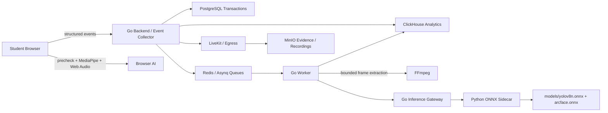

# Техническое задание: ARGUS AI Proctoring

**Дата:** 2026-06-01  
**Статус:** архитектурная спецификация перед финальной реализацией и production hardening  
**Область:** ARGUS AI proctoring platform, без деплоя на сервер в рамках этого документа

## 1. Цель

ARGUS AI должен быть production-grade системой онлайн-прокторинга, которая:

- запускает экзаменационную сессию без зависимости от тяжелого AI-инференса;
- собирает браузерные, видео, аудио, сетевые и системные сигналы;
- выполняет тяжелый AI-анализ асинхронно через изолированный inference контур;
- хранит события и доказательства так, чтобы проктор мог принять проверяемое решение;
- интегрируется с внешними LMS/OES через стабильный API, webhooks и SDK flow;
- не ломает текущие клиентские контракты при добавлении новых AI-событий.

Главный принцип: AI помогает выявлять риск, но итоговые санкции по спорным сессиям проходят через human review.

## 2. Сравнение с рынком

ARGUS не должен копировать конкретный коммерческий продукт, но должен закрывать базовый набор возможностей, который ожидается от современных систем online proctoring:

| Рынок | Ожидаемая возможность | ARGUS v1 target |
| --- | --- | --- |
| Proctorio | browser lockdown, identity verification, recording, automated suspicious behavior flags | browser/security events, face verification, selective recording, AI flags |
| Honorlock | automated + human review, ID verification, browser monitoring, session evidence | review queue, identity precheck, browser events, evidence archive |
| Respondus Monitor | webcam recording, startup sequence, automated analysis for review | pre-exam checks, LiveKit recording, timeline markers |
| ProctorU / Meazure Learning | live/record-and-review proctoring, identity and environment checks | live monitoring, archive/review, external integration |

Reference links:

- Proctorio: https://proctorio.com/
- Honorlock: https://honorlock.com/
- Respondus Monitor: https://web.respondus.com/he/monitor/
- Meazure Learning / ProctorU: https://www.meazurelearning.com/

## 3. Current Implementation Inventory

### 3.1 Уже реализовано в репозитории

Backend:

- `AI_ARCHITECTURE.md` описывает текущий AI pipeline: Nuxt MediaPipe/Web Audio, Go inference gateway, Python ONNX sidecar, ClickHouse event mapping.
- `DEVELOPER_GUIDE.md` фиксирует модельные файлы, env/config mapping, тесты, Docker sidecar, fail-fast правила.
- `cmd/inference/main.go` содержит inference gateway с `stub` только при `allow_stub=true` и production path через `python_bridge`.
- `ai-sidecar/` содержит Python сервис, model manifest, downloader, tests и Dockerfile.
- `internal/infrastructure/worker/ai_analysis_handler.go` обрабатывает evidence asynchronously и пишет backend AI events в ClickHouse.
- `internal/infrastructure/worker/frame_extractor.go` ограничивает извлечение кадров из видео через interval/cap.
- `internal/application/usecase/audio_bridge.go` агрегирует structured audio telemetry и пишет derived `audio_anomaly` в ClickHouse.
- `internal/infrastructure/livekit/egress.go` и `webhook.go` закрывают LiveKit recording request и callback-to-DB контур.
- `docs/EXTERNAL_INTEGRATION.md` описывает внешние сессии, webhooks, SDK flow и partner onboarding.
- `docs/LIVEKIT_EGRESS_RECORDING.md` описывает selective recording через LiveKit Egress.

Frontend:

- `app/composables/useVisionEngine.ts` использует MediaPipe Face Landmarker для face count, bbox, head pose, gaze и frame quality.
- `app/composables/useAudioEngine.ts` и `app/lib/ai/realtimeEventRules.ts` формируют structured audio/vision events.
- `app/components/PreExamCheck.vue` реализует pre-exam media permission, face enrollment, storage и network gate.
- `app/components/ReviewPanel.vue`, `app/pages/monitoring.vue`, `app/pages/analytics.vue`, `app/pages/docs.vue` дают UI основу для мониторинга, review и интеграций.

Infrastructure/CI:

- Backend CI уже содержит `ai-sidecar-test`, Go tests, lint/vet/security checks.
- Production deploy должен оставаться отдельной стадией и не должен выполняться до готовности server secrets, model files и env.

### 3.2 Что еще не считается завершенным

- В репозитории не должны храниться большие model weights; для production нужны реальные `models/yolov8n.onnx` и `models/arcface.onnx`, доставленные через private artifact store или server-mounted directory.
- Нужен финальный E2E сценарий: внешняя сессия -> precheck -> event ingestion -> AI queue -> ClickHouse event -> review -> webhook/result.
- Нужна calibration matrix для thresholds по типам экзаменов и организациям.
- Нужна smoke-проверка Docker stack с реальными model files, а не только synthetic tests.
- Нужна production policy по retention: сколько хранить raw evidence, recordings, ClickHouse events, review decisions.
- Нужен dashboard checklist для операторов: как понять, что inference degraded, queue saturated, ClickHouse unavailable или model missing.

## 4. Product Scope

### 4.1 In Scope для ARGUS v1

- Hard-gated pre-exam check: camera, microphone, face enrollment, local storage, network tier.
- Browser-side AI signals: face count, gaze/head pose, liveness-lite signals, audio level/VAD telemetry.
- Backend AI deep scan: YOLO object detection, ArcFace face matching, liveness/spoof classification when supported by model output.
- Audio AI bridge: no raw audio upload by default; only structured telemetry and derived events.
- Selective recording: record around critical violations or configured session segments, not continuous full-session by default.
- Human review workflow: every high-risk/voidable session requires explicit review decision.
- External API: partner session create/result lookup/webhook lifecycle.
- ClickHouse analytics events with denormalized AI fields for fast filtering.
- Async worker isolation: inference failures must not block student session progress.

### 4.2 Out of Scope для ближайшей итерации

- Self-training/custom model training внутри production backend.
- Continuous frame extraction from full exam videos.
- Automatic exam invalidation without review policy.
- Raw microphone stream storage by default.
- Kubernetes migration before Docker Compose production baseline is stable.

## 5. Roles

| Role | Description | Main actions |
| --- | --- | --- |
| Student | Пользователь, сдающий экзамен | precheck, exam start, consent, monitored session |
| Proctor | Оператор live/review мониторинга | live watch, acknowledge events, review decisions |
| Org Admin | Администратор организации | configure exam policy, users, API keys, review rules |
| External Partner | LMS/OES интегратор | create sessions, receive webhooks, fetch verdict/result |
| System Worker | Background services | AI analysis, exports, recording callbacks, retry/DLQ |

## 6. Core Session Flow

1. External platform or admin creates an exam/session.
2. Student opens session link and accepts consent.
3. `PreExamCheck` requests camera/microphone permissions.
4. Browser captures reference face and sends only structured metadata or enrolled reference through the approved session flow.
5. Session starts after local device, face and network checks pass.
6. Browser emits low-frequency structured events through existing `sendEvent` / gRPC-Web pipeline.
7. Backend persists canonical events and analytics rows.
8. Critical events enqueue selective recording and/or AI deep-scan jobs.
9. Worker extracts bounded frames only by interval or trigger.
10. Go inference gateway sends frames to Python ONNX sidecar.
11. Sidecar returns object/face/audio-related findings.
12. Worker writes `source=backend_ai` events to ClickHouse.
13. Review UI shows timeline, evidence, AI confidence, recording fragments and risk score.
14. Proctor/org admin submits review decision.
15. External partner receives webhook or polls final result.

## 7. Event Taxonomy

### 7.1 Identity and Face

| Event | Source | Severity default | Notes |
| --- | --- | --- | --- |
| `face_not_detected` | Frontend MediaPipe | warning | Sustained absence, not single-frame absence |
| `multiple_faces_detected` | Frontend/backend | critical | More than one face for configured duration |
| `face_mismatch` | Frontend/backend | critical | Requires reference embedding/photo |
| `face_spoof_detected` | Frontend/backend | critical | Only if model supports reliable liveness signal |
| `head_pose_anomaly` | Frontend | warning | Yaw/pitch/roll outside configured threshold |
| `face_embedding_telemetry` | Frontend/backend | telemetry | Must not be treated as violation by itself |
| `BACKEND_AI_FACE_MISMATCH` | Backend AI | critical | Written only when similarity is computed and below threshold |

Rules:

- Missing reference embedding is an enrollment/config problem, not fraud.
- Negative ArcFace cosine similarity is valid and must be compared against threshold.
- Face mismatch must include confidence/similarity and model source.

### 7.2 Objects and Environment

| Event | Source | Severity default | Notes |
| --- | --- | --- | --- |
| `phone_detected` / `BACKEND_AI_HIDDEN_OBJECT` | YOLO/backend | critical | `cell phone` class above threshold |
| `book_detected` | YOLO/backend | warning/critical | Severity depends on exam policy |
| `earbuds_detected` | Frontend/backend/custom model | warning/critical | YOLOv8 COCO does not reliably detect earbuds; needs custom class or explicit policy |
| `multiple_persons` | Frontend/backend | critical | Do not infer from YOLO `person` alone; use face count/identity evidence |
| `external_display_detected` | Browser/system probe | critical | Needs client support or secure browser integration |

Rules:

- Do not treat a standalone YOLO `person` detection as fraud in webcam frame.
- Object confidence threshold must be config-driven.
- Evidence must include bbox, class, confidence and source frame timestamp.

### 7.3 Browser and System Integrity

| Event | Source | Severity default | Notes |
| --- | --- | --- | --- |
| `tab_switch` | Browser | warning/critical | Based on configured limit |
| `fullscreen_exit` | Browser | warning | Critical after repeated or long exit |
| `copy_paste_blocked` | Browser | telemetry/warning | Depends on exam lockdown mode |
| `virtual_camera_detected` | Browser/device probe | critical | Best effort in normal browser |
| `remote_access_detected` | System probe/secure browser | critical | Requires desktop agent or secure browser for high confidence |

Rules:

- Normal browser cannot provide full OS lockdown. Any claim of process scanning or remote access blocking must be marked as secure-browser/agent-dependent.
- Web-only mode must be transparent about limitations.

### 7.4 Audio

| Event | Source | Severity default | Notes |
| --- | --- | --- | --- |
| `audio_level_telemetry` | Frontend Web Audio | telemetry | Raw audio is not stored |
| `voice_activity` | Frontend VAD | warning | Requires duration threshold |
| `audio_anomaly` | Backend bridge | warning/critical | Derived after sustained RMS/VAD threshold |
| `second_speaker_detected` | Frontend/backend classifier | critical | Needs model confidence and cooldown |
| `whisper_detected` | Frontend/backend classifier | warning/critical | Needs classifier confidence |

Rules:

- Raw microphone audio is not sent by default.
- Backend audio anomalies are ClickHouse-only unless a separate realtime contract is approved.
- Thresholds must be configurable per organization/exam.

## 8. Architecture

### 8.1 Runtime separation



### 8.2 Isolation rules

- HTTP session APIs must not call ONNX directly.
- Inference must run behind queue and concurrency limits.
- Queue saturation drops or delays inference frames; it must not block student heartbeat/session state.
- ClickHouse write failures go through resilient writer/DLQ and must not rollback PostgreSQL session transactions.
- Python sidecar must fail at startup when `MODEL_FAIL_FAST=true` and required model files are missing/corrupt.
- Stub inference is allowed only in explicit local dev config with `allow_stub=true`.

## 9. Model Inventory

| Model | File | Purpose | Input | Output | Production rule |
| --- | --- | --- | --- | --- | --- |
| YOLOv8n ONNX or compatible YOLO export | `models/yolov8n.onnx` | Detect `cell phone`, `book`, selected COCO/custom objects | commonly `[1,3,640,640]` FP32 RGB | `[1,84,N]` or `[1,85,N]` detections | Must pass manifest size/hash check |
| ArcFace / InsightFace ONNX | `models/arcface.onnx` | Face embedding and identity verification | commonly `[1,3,112,112]` FP32 RGB | commonly 512-float embedding | Must compare only with trusted reference embedding |

Production model delivery:

- Model binaries are not committed to Git unless Git LFS is explicitly configured.
- CI/test can use synthetic ONNX models.
- Production uses mounted `/models` or private artifact URLs with SHA256 checks.
- `ai-sidecar/model_manifest.json` remains the source of truth for filenames and artifact env names.

## 10. Configuration and Thresholds

All sensitivity settings must be configurable through YAML/env. Hardcoding production thresholds in handlers is prohibited.

| Config | Env | Default | Meaning |
| --- | --- | --- | --- |
| `inference.engine_type` | `EVENT_COLLECTOR_INFERENCE_ENGINE_TYPE` | `python_bridge` | `stub` or `python_bridge`; stub requires allow flag |
| `inference.allow_stub` | `EVENT_COLLECTOR_INFERENCE_ALLOW_STUB` | `false` | Enables local-only stub |
| `inference.python_bridge_url` | `EVENT_COLLECTOR_INFERENCE_PYTHON_BRIDGE_URL` | `http://ai-sidecar:8091` in Docker | Sidecar base URL |
| `inference.concurrency` | `EVENT_COLLECTOR_INFERENCE_CONCURRENCY` | `4` | Max concurrent frame analyses |
| `inference.frame_sample_interval_sec` | `EVENT_COLLECTOR_INFERENCE_FRAME_SAMPLE_INTERVAL_SEC` | `5` | Video frame sampling interval |
| `inference.max_video_dur_sec` | `EVENT_COLLECTOR_INFERENCE_MAX_VIDEO_DUR_SEC` | `300` | Extraction cap basis |
| `inference.max_frame_bytes` | `EVENT_COLLECTOR_INFERENCE_MAX_FRAME_BYTES` | `10485760` | Max single image/frame payload |
| `inference.face_mismatch_threshold` | `EVENT_COLLECTOR_INFERENCE_FACE_MISMATCH_THRESHOLD` | `0.62` | ArcFace mismatch cutoff |
| `inference.object_confidence_threshold` | `EVENT_COLLECTOR_INFERENCE_OBJECT_CONFIDENCE_THRESHOLD` | `0.70` | YOLO object cutoff |
| `audio_bridge.enabled` | `EVENT_COLLECTOR_AUDIO_BRIDGE_ENABLED` | `true` | Enables backend audio aggregation |
| `audio_bridge.noise_threshold_db` | `EVENT_COLLECTOR_AUDIO_NOISE_THRESHOLD_DB` | `-35` | Sustained noise threshold |
| `audio_bridge.vad_confidence_threshold` | `EVENT_COLLECTOR_AUDIO_VAD_CONFIDENCE_THRESHOLD` | `0.70` | Voice activity confidence cutoff |
| `MODEL_FAIL_FAST` | `MODEL_FAIL_FAST` | `true` in production | Sidecar startup safety |

Per-exam settings from `proctoring_settings` override global sensitivity only through approved policy fields.

## 11. Storage

### PostgreSQL

PostgreSQL stores transactional state:

- organizations, users, API keys;
- exams and proctoring settings;
- sessions and external sessions;
- review decisions and appeals;
- recording metadata (`livekit_recordings`);
- webhook subscriptions/delivery state when transactional guarantees are needed.

### ClickHouse

ClickHouse stores high-volume analytics events:

- browser/system events;
- telemetry events;
- backend AI findings with denormalized fields;
- derived audio anomalies;
- timeline data for analytics and review.

ClickHouse event rows must preserve:

- `event_id`, `session_id`, `student_id`, `exam_id`, `org_id`;
- `event_type`, `source`, `severity`, `confidence`;
- `occurred_at`, `received_at`;
- payload JSON;
- AI denormalized fields such as `face_similarity`, `face_bbox`, `face_embedding`, `object_class`, `object_confidence`, `audio_rms_db`.

Sentinel defaults must remain explicit:

- `face_similarity=-1`
- `liveness_score=-1`
- `audio_rms_db=-100`

### MinIO

MinIO stores immutable evidence:

- selective recording fragments;
- exported reports;
- forensic evidence fragments;
- optional model artifacts only if an internal artifact bucket is approved.

Recording path pattern:

```text
content/recordings/{roomName}/{sessionId}-{studentId}.mp4
```

## 12. External Integration

ARGUS external API must support:

- session creation with partner-owned `external_session_id`;
- pre-signed or hosted student launch URL;
- event webhooks signed with HMAC-SHA256;
- result lookup by ARGUS session ID and partner result/session ID;
- stable verdict fields: `clean`, `needs_review`, `confirmed_violation`, `void_recommended`, `technical_failure`.

Compatibility rule: adding backend AI events must not break existing external session create/result contracts.

## 13. Review and Verdict Policy

Every session receives an internal risk state:

- `clean`: no significant events;
- `low_risk`: minor telemetry or recoverable warnings;
- `needs_review`: repeated warnings or one critical AI/browser event;
- `confirmed_violation`: human reviewer confirmed violation;
- `technical_failure`: session quality was insufficient for fair judgment.

Automatic invalidation is not enabled by default. The system can recommend `void_recommended`, but an explicit review policy must decide whether automatic actions are allowed for a given organization/exam.

Review decision must record:

- reviewer ID and role;
- reviewed event IDs;
- evidence links;
- decision;
- reason code;
- free-text note;
- timestamp;
- immutable audit entry.

## 14. Performance and Failure Modes

### Student path SLO

- Event ingestion should not wait for ONNX model inference.
- Heartbeat/session state must continue when inference, ClickHouse or recording is degraded.
- Browser events should be low-frequency and structured.

### Queue and circuit breaker

- Inference queue has lower priority than critical transactional queues.
- If worker capacity is exhausted, frames are dropped or delayed according to policy.
- Dropped frames must increment operational metrics.
- Sidecar health failure must make inference degraded, not exam session unavailable.

### Frame extraction

- FFmpeg extraction must never process continuous full videos without caps.
- Default extraction: at most one frame every 5 seconds.
- Triggered extraction: allowed around critical event windows.
- Max frame count is derived from `max_video_dur_sec / frame_sample_interval_sec`.

## 15. Security and Privacy

- Only 80/443 should be public once reverse proxy is in production.
- Backend, frontend, ClickHouse, Redis, PostgreSQL and sidecar internal ports must not be exposed publicly.
- API keys and webhook secrets must never appear in logs.
- Model files and secrets are mounted/read through env/artifact store, not committed.
- Raw audio is not stored by default.
- Consent record is required before monitored session starts.
- Evidence access uses role checks and time-limited URLs.
- Review and admin actions are audit logged.
- External webhook signatures use HMAC-SHA256 with timestamp/replay protection.

## 16. Testing Requirements

### Backend

Required before implementation is called complete:

```bash
go test ./cmd/inference ./internal/infrastructure/inference ./internal/infrastructure/worker ./internal/transport/grpc ./internal/application/usecase
go test ./...
```

### Python sidecar

```bash
python -m unittest discover ai-sidecar/tests -v
python ai-sidecar/scripts/download_models.py --models-path models --check-only --require-sha256
```

Synthetic tests are sufficient for CI. Production readiness additionally requires real model smoke tests against the mounted model directory.

### Frontend

```bash
npm run lint
npm run test
npm run build
```

Browser verification must cover:

- pre-exam face capture;
- audio permission and telemetry;
- session start;
- event emission;
- review page display for backend AI events.

### E2E readiness test

The release is not production-ready until this full flow passes:

1. Create external session.
2. Open student launch URL.
3. Complete pre-exam checks.
4. Emit face/audio/browser events.
5. Trigger one evidence/AI analysis job.
6. Verify ClickHouse AI event.
7. Verify review panel timeline.
8. Submit review decision.
9. Verify external result/webhook.

## 17. Production Readiness Checklist

Required before server rollout:

- `models/yolov8n.onnx` is present and hash-verified.
- `models/arcface.onnx` is present and hash-verified.
- `MODEL_FAIL_FAST=true`.
- `EVENT_COLLECTOR_INFERENCE_ALLOW_STUB=false`.
- ClickHouse schema migrations applied.
- PostgreSQL migrations applied.
- Redis persistence enabled for Asynq.
- Docker resource limits configured.
- Internal ports are not public.
- TLS certificates exist or certbot first-run is completed.
- GitLab CI variables are set and verified.
- Backup/restore procedure exists for PostgreSQL and ClickHouse.
- Smoke test passes after `docker compose up -d`.

## 18. Implementation Roadmap

### Phase 0: Repository and CI baseline

Goal: keep GitLab as single source of truth.

Deliverables:

- clean repo status for backend/frontend/infra;
- CI pipeline green without server deploy dependency;
- documented env and model requirements;
- known issue for infra line-ending normalization closed with a separate docs/ci commit if needed.

### Phase 1: Product contract freeze

Goal: lock the proctoring event taxonomy and review policy before adding more detectors.

Deliverables:

- canonical event severity matrix;
- final review verdict enum;
- external webhook result schema;
- acceptance tests for API compatibility.

### Phase 2: Real model smoke path

Goal: verify real YOLO/ArcFace models in sandbox.

Deliverables:

- private artifact delivery or mounted `models/`;
- model hash checks;
- sidecar startup smoke test;
- one backend frame analysis test with real weights;
- thresholds calibrated for low false-positive mode.

### Phase 3: End-to-end proctoring flow

Goal: prove full session lifecycle.

Deliverables:

- E2E script or Playwright flow for external session -> precheck -> events -> review -> result;
- ClickHouse event assertions;
- MinIO evidence assertions;
- review decision assertions.

### Phase 4: Production deploy hardening

Goal: safe rollout after server baseline is ready.

Deliverables:

- Docker compose with resource limits and isolated networks;
- reverse proxy and TLS;
- model mount;
- backup scripts;
- health dashboards;
- rollback command set.

## 19. Current Decision

ARGUS should proceed with the current architecture:

- browser-local lightweight AI for immediate UX;
- backend async inference for heavier evidence analysis;
- Python sidecar for ONNX isolation;
- ClickHouse for analytics/event volume;
- PostgreSQL for transactional decisions;
- MinIO for recordings/evidence;
- human review for enforceable outcomes.

This is the correct pragmatic path for the current team and server constraints. The next work should be implementation planning against this document, not adding new detectors ad hoc.
